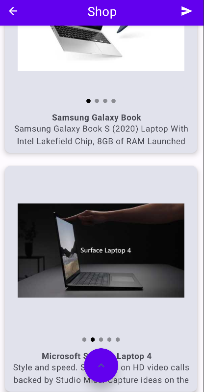
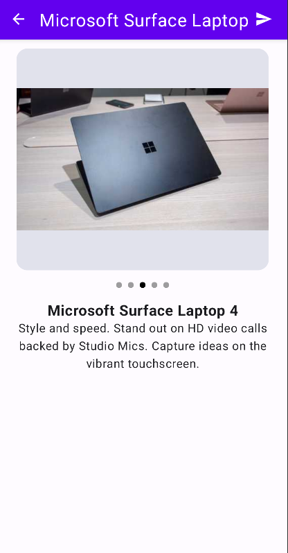

# ProductsAPI
 A project created with a free available API using most recommended techniques and libraries.
 
 Project created in MVVM architecture in Compose, following the clean architecture.

 Implemented some quality of life features like loading state (handling loading/error/success state for network call), pull to refresh, scroll to top and scrollable state.

 Created using Dependency Injection (Dagger/Hilt), Coroutines, Glide, [Compose-destinations](https://github.com/raamcosta/compose-destinations).

 Allows user to browse a list of items and navigate to a details page on click (whtough Compose-destinations library).

 
 
